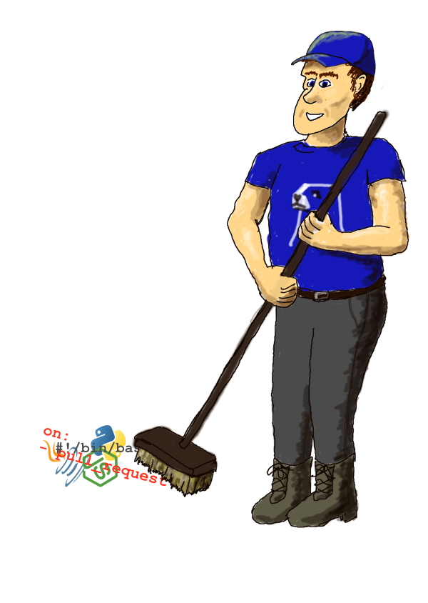

---
hide:
- navigation
- toc
---

# Custcodian

Automated supply-chain cleanup

---

{width="300px" height="422px"}
/// caption
(yes, art is not my gift)
///

<iframe width="560" height="315" src="https://www.youtube-nocookie.com/embed/YrIdOdX1dCI?si=Pqw5v10FDxSJ4-Xl" title="Getting Started with Minder" frameborder="0" allow="accelerometer; autoplay; clipboard-write; encrypted-media; gyroscope; picture-in-picture; web-share" referrerpolicy="strict-origin-when-cross-origin" allowfullscreen></iframe>

---

Custcodian offers the following services:

## [Cloud-hosted Minder](hosted/index.md)

The easiest way to get started with [Minder](https://mindersec.github.io)

## [Support for Self-Hosted Minder](services/index.md#on-premises-hosting)

Enterprise-grade Minder hosting

## [Profile and Policy development](services/index.md#profile-and-policy-development)

Work with our experts to implement customized policies for your organization
